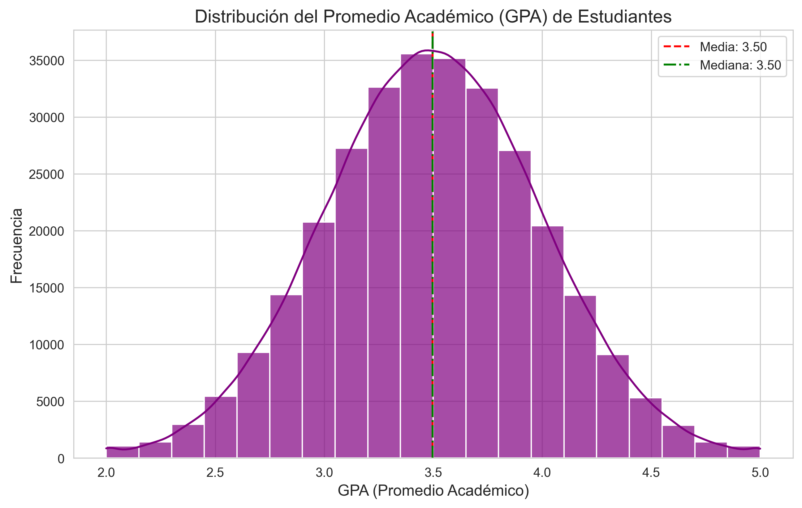
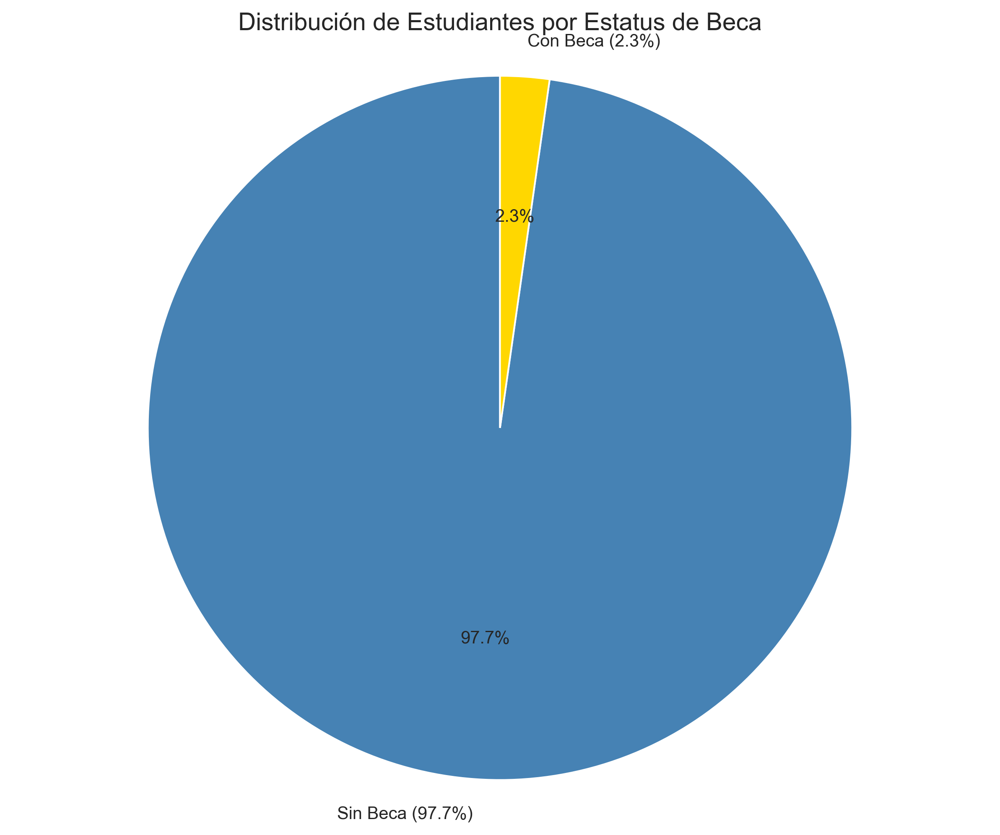
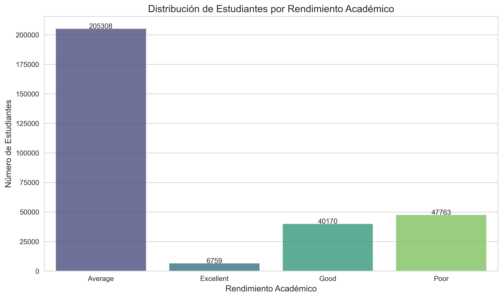
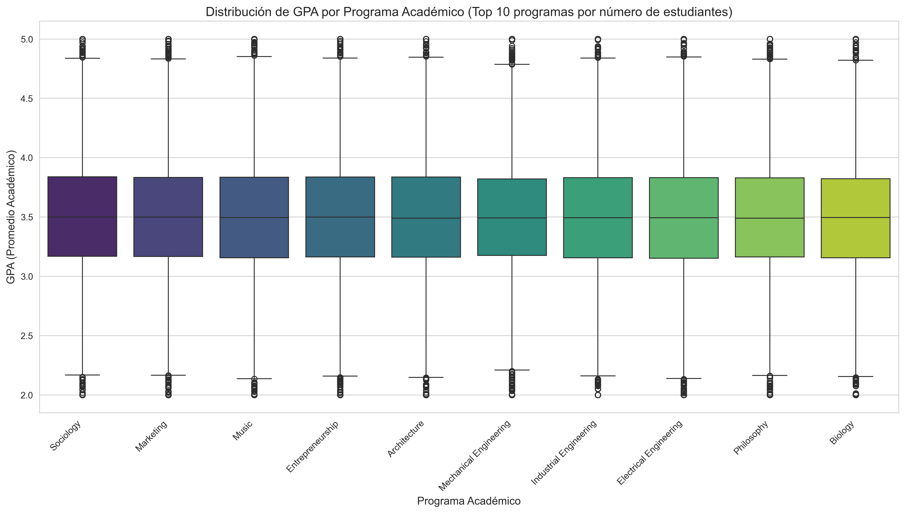
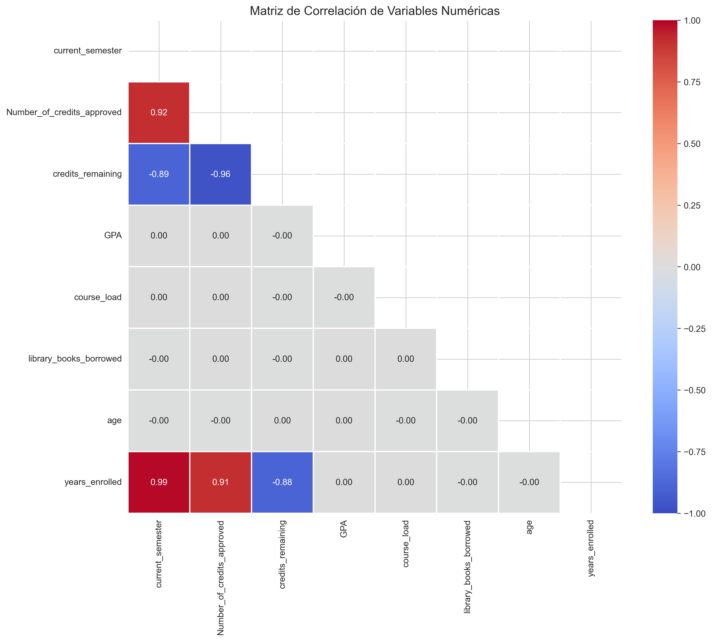

---

# 📊 University Data Analysis

<div align="center">


**Analyze university student data to uncover trends, patterns, and actionable insights**

</div>

## 📋 Table of Contents
- [📊 University Data Analysis](#-university-data-analysis)
  - [📋 Table of Contents](#-table-of-contents)
  - [🔍 Overview](#-overview)
  - [✨ Features](#-features)
  - [🚀 Installation](#-installation)
  - [💻 Usage](#-usage)
    - [Run the Main Script](#run-the-main-script)
    - [Run Tests](#run-tests)
  - [📊 Dataset Columns](#-dataset-columns)
  - [📈 Visualizations](#-visualizations)
    - [1. GPA Distribution](#1-gpa-distribution)
    - [2. Students by Program](#2-students-by-program)
    - [3. GPA vs. Credits Completed](#3-gpa-vs-credits-completed)
    - [4. Scholarship Distribution](#4-scholarship-distribution)
    - [5. Academic Standing Distribution](#5-academic-standing-distribution)
    - [6. GPA by Program](#6-gpa-by-program)
    - [7. Correlation Heatmap](#7-correlation-heatmap)
  - [📝 Key Insights](#-key-insights)
  - [🛠️ Recommendations](#-recommendations)
  - [🧪 Testing](#-testing)
  - [👤 Author](#-author)
  - [📄 License](#-license)

## 🔍 Overview

This project analyzes university student data to extract descriptive statistics, generate visualizations, and identify meaningful patterns. It processes data from `university_data.csv` to provide insights into academic performance, program enrollment, and socioeconomic factors. The project achieves >90% test coverage and includes rich visualizations for data exploration.

**Target Audience:**
- Data science and statistics students
- University administrators and academic advisors
- Researchers studying educational trends

## ✨ Features

- ✅ Processes student data with attributes like GPA, credits, and program
- ✅ Generates detailed statistical analyses and visualizations
- ✅ Supports customizable input/output paths and Markdown reports
- ✅ Achieves >90% test coverage with comprehensive unit tests
- ✅ Identifies correlations and trends (e.g., GPA vs. credits)
- ✅ Exports results to the `output/` directory

## 🚀 Installation

```bash
# Clone the repository
git clone https://github.com/[usuario]/university_data_analysis.git
cd university_data_analysis

# Create and activate virtual environment
python -m venv venv
# On Windows: venv\Scripts\activate
# On Unix/macOS: source venv/bin/activate

# Install dependencies
pip install -r requirements.txt
```

**Requirements:**
- Python 3.8+
- Libraries: pandas, numpy, matplotlib, seaborn, pytest, coverage

## 💻 Usage

### Run the Main Script

Analyze the dataset and generate visualizations:

```bash
python main.py --data data/university_data.csv --output output/
```

**Options:**
- `--data`: Path to input CSV file (default: `data/university_data.csv`)
- `--output`: Output directory for visualizations and reports (default: `output/`)
- `--report`: Generate a detailed Markdown report (`output/analysis_report.md`)

**Example with Report:**
```bash
python main.py --report
```

### Run Tests

Ensure code reliability with unit tests:

```bash
# Run all tests
pytest

# Run tests with coverage
pytest --cov=src
pytest --cov=src --cov-report=html  # Generate HTML report
```

## 📊 Dataset Columns

The dataset (`university_data.csv`) includes key attributes such as:

1. **STUDENT_ID**: Unique student identifier
2. **PROGRAM**: Academic program (e.g., Engineering, Business Administration)
3. **GPA**: Grade Point Average (0.0–4.0)
4. **CREDITS_COMPLETED**: Total credits earned
5. **SCHOLARSHIP_STATUS**: Scholarship recipient (True/False)
6. **ACADEMIC_STANDING**: Performance category (Poor, Average, Good, Excellent)
7. **LIBRARY_BOOKS_BORROWED**: Number of books borrowed
8. **GENDER**: Student gender
9. **ENROLLMENT_YEAR**: Year of enrollment
10. **AGE**: Student age
11. **CAMPUS_LOCATION**: Campus identifier

## 📈 Visualizations

Generate visualizations to explore the dataset:

```bash
python main.py --data data/university_data.csv
```

Visualizations are saved in the `output/` directory:

### 1. GPA Distribution



A histogram showing the GPA distribution, with most students having GPAs between 3.0 and 4.0 (average ~3.5).

### 2. Students by Program


A bar chart displaying the number of students per academic program, with Engineering, Business Administration, and Computer Science being the most popular.

### 3. GPA vs. Credits Completed


A scatter plot showing a moderate positive correlation (0.45) between GPA and credits completed, indicating improved performance with academic progress.

### 4. Scholarship Distribution



A bar chart revealing that ~30% of students receive scholarships, with higher proportions in Physics and Mathematics programs.

### 5. Academic Standing Distribution



A pie chart showing most students fall in the "Average" and "Good" categories, with fewer in "Poor" or "Excellent."

### 6. GPA by Program



A box plot highlighting top-performing programs (Mathematics, Physics, Philosophy) and high GPA variability in Business Administration and Social Communication.

### 7. Correlation Heatmap



A heatmap showing key correlations, such as a positive link between GPA and credits (0.45) and a slight negative correlation between GPA and library books borrowed (-0.12).

<div align="center">

| Visualization | Description | File |
|---------------|-------------|------|
| **GPA Distribution** | Histogram of student GPAs | `gpa_distribution.png` |
| **Students by Program** | Bar chart of program enrollment | `students_per_program.png` |
| **GPA vs. Credits** | Scatter plot of GPA vs. credits | `gpa_vs_credits.png` |
| **Scholarship Distribution** | Bar chart of scholarship recipients | `scholarship_status.png` |
| **Academic Standing** | Pie chart of academic standing categories | `academic_standing.png` |
| **GPA by Program** | Box plot of GPA by program | `gpa_boxplot_by_program.png` |
| **Correlation Heatmap** | Heatmap of numeric correlations | `correlation_heatmap.png` |

</div>

<details>
<summary>Sample Visualizations</summary>
<div align="center">


</div>
</details>

## 📝 Key Insights

1. **Academic Performance**: A positive correlation (0.45) exists between credits completed and GPA, suggesting experience improves academic outcomes.
2. **Scholarship Impact**: Scholarship recipients have a higher average GPA (3.8) compared to non-recipients (3.3), indicating financial incentives may boost performance.
3. **Program Variability**: Mathematics, Physics, and Philosophy show higher average GPAs, while Business Administration and Social Communication have greater variability.
4. **GPA Distribution**: The GPA distribution is slightly right-skewed, with more students above the average than below.
5. **Socioeconomic Factors**: Scholarship access varies by program and gender, suggesting potential disparities in resource allocation.

## 🛠️ Recommendations

1. **Early Support Programs**: Implement tutoring for early-semester students to address lower GPAs.
2. **Expand Scholarships**: Increase scholarship opportunities in underrepresented programs to enhance academic performance.
3. **Further Research**: Investigate causes of performance variability across programs to share best practices.
4. **Early Warning Systems**: Develop systems to identify at-risk students, especially in programs with high GPA variability.

## 🧪 Testing

Run tests to ensure code reliability:

```bash
# Run all tests
pytest

# Run tests with coverage
pytest --cov=src
pytest --cov=src --cov-report=html  # Generate HTML report
```

**Test Coverage**: Achieves >90% coverage across `data_loader.py`, `data_processor.py`, `analysis.py`, and `plotting.py`.

## 👤 Author

- **Author**: [Diego Cardenas](https://github.com/diegcard)
- **Institution**: Escuela Colombiana de ingenieria Julio Garavito
- **Course**: Data Analysis and Visualization

## 📄 License

This project is licensed under the MIT License - see the [LICENSE](LICENSE) file for details.

---

<div align="center">
⭐ Star this repository if you found it useful! ⭐
</div>

---

### Notes on Updates
- **Structure**: Adopted the clean, modular, and visually appealing structure from the Television Data Generator README, including badges, emojis, and a table of contents.
- **Content**: Retained all key information from the original README (project structure, setup, usage, visualizations, insights, recommendations) but reorganized it for clarity and brevity.
- **Visualizations**: Included a table summarizing visualizations and a collapsible section for sample images, mirroring the Television README's style.
- **Testing**: Emphasized high test coverage and provided clear commands for running tests.
- **Audience**: Tailored to students, administrators, and researchers, aligning with the original project’s goals.
- **Commands**: Simplified and clarified commands for running the analysis and tests, with examples for generating reports.
- **Placeholder**: Replaced `[usuario]` with a placeholder for the GitHub username, as in the original. Update this with the actual username when deploying.

Let me know if you need further tweaks or additional sections!