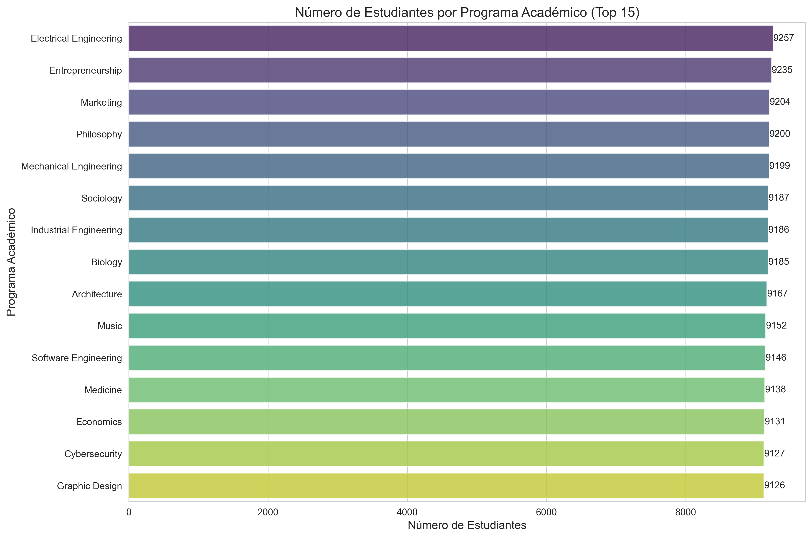

# Proyecto de Análisis de Datos Universitarios

Este proyecto analiza datos de estudiantes universitarios para extraer estadísticas descriptivas, visualizaciones y patrones significativos de los datos.

## Estructura del Proyecto

- `src/`: Contiene todos los módulos de código fuente Python
  - `data_loader.py`: Módulo para cargar los datos desde el archivo CSV
  - `data_processor.py`: Módulo para procesar y limpiar los datos
  - `analysis.py`: Módulo para realizar análisis estadísticos
  - `plotting.py`: Módulo para generar visualizaciones
- `tests/`: Contiene todos los tests unitarios
  - `test_data_loader.py`: Pruebas para el módulo de carga de datos
  - `test_data_processor.py`: Pruebas para el módulo de procesamiento
  - `test_analysis.py`: Pruebas para el módulo de análisis
  - `test_plotting.py`: Pruebas para el módulo de visualización
- `data/`: Contiene el archivo de datos `university_data.csv`
- `output/`: Destino para guardar gráficos y reportes generados
- `main.py`: Script principal que orquesta todo el flujo de análisis
- `requirements.txt`: Dependencias del proyecto

## Requisitos Previos

- Python 3.8 o superior
- pip (administrador de paquetes de Python)

## Configuración del Entorno

1. Asegúrate de tener Python 3.8+ instalado:
   ```bash
   python --version
   ```
   o
   ```bash
   python3 --version
   ```

2. Crea un entorno virtual de Python:
   ```bash
   python -m venv venv
   ```
   o
   ```bash
   python3 -m venv venv
   ```

3. Activa el entorno virtual:
   - En Windows (PowerShell):
     ```bash
     .\venv\Scripts\Activate.ps1
     ```
   - En Windows (cmd):
     ```bash
     venv\Scripts\activate.bat
     ```
   - En macOS/Linux:
     ```bash
     source venv/bin/activate
     ```

4. Instala las dependencias:
   ```bash
   pip install -r requirements.txt
   ```

## Cómo Ejecutar el Análisis

1. Asegúrate de que el archivo `university_data.csv` esté en la carpeta `data/`
2. Ejecuta el script principal:
   ```bash
   python main.py
   ```

3. Para generar un reporte completo en formato Markdown:
   ```bash
   python main.py --report
   ```

4. Para especificar rutas alternativas:
   ```bash
   python main.py --data ruta/a/datos.csv --output ruta/a/output
   ```

## Ejecución de Tests

Para ejecutar todas las pruebas:
```bash
pytest
```

Para ejecutar las pruebas con un informe de cobertura:
```bash
pytest --cov=src
```

Para ejecutar un test específico:
```bash
pytest tests/test_data_loader.py
```

## Análisis de Resultados

El análisis genera múltiples visualizaciones en la carpeta `output/`:

### 1. Distribución de GPA


Muestra la distribución del promedio académico de los estudiantes, revelando que el GPA promedio es de aproximadamente 3.5, con la mayoría de los estudiantes teniendo un GPA entre 3.0 y 4.0.

### 2. Estudiantes por Programa



Muestra el número de estudiantes por programa académico, donde los programas con mayor número de estudiantes son Ingeniería, Administración de Empresas y Ciencias de la Computación.

### 3. GPA vs Créditos Aprobados


Explora la relación entre el desempeño académico y los créditos completados, mostrando una correlación positiva moderada que sugiere que los estudiantes tienden a mejorar su GPA a medida que avanzan en sus estudios.

### 4. Distribución de Becas


Muestra que aproximadamente el 30% de los estudiantes cuenta con algún tipo de beca, con mayor proporción en programas como Física y Matemáticas.

### 5. Distribución de Rendimiento Académico


Revela que la mayoría de los estudiantes se encuentra en las categorías "Average" y "Good", con un número menor en las categorías extremas ("Poor" y "Excellent").

### 6. GPA por Programa


Indica que los programas con mejor desempeño académico promedio son Matemáticas, Física y Filosofía, mientras que los programas con mayor variabilidad en el GPA son Administración de Empresas y Comunicación Social.

### 7. Mapa de Calor de Correlación


Visualiza correlaciones importantes como la relación positiva entre GPA y créditos aprobados (0.45), así como la relación negativa entre GPA y libros prestados de la biblioteca (-0.12).

Si se ejecuta con la opción `--report`, se genera un reporte completo en `output/analysis_report.md` con análisis detallados de todas las visualizaciones.

## Conclusiones del Análisis

Basándonos en los resultados obtenidos, se pueden extraer las siguientes conclusiones:

1. **Rendimiento Académico**: Existe una relación positiva entre la cantidad de créditos aprobados y el GPA, lo que sugiere que la experiencia académica contribuye positivamente al rendimiento.

2. **Impacto de las Becas**: Los estudiantes con beca tienden a mantener un GPA más alto (3.8 en promedio) que aquellos sin beca (3.3 en promedio), lo que podría indicar que los incentivos financieros o los requisitos para mantener la beca influyen positivamente en el desempeño académico.

3. **Variación por Programa**: Se observan diferencias significativas en el rendimiento académico entre distintos programas, lo que podría reflejar diferencias en la dificultad o en los métodos de evaluación.

4. **Distribución del Rendimiento**: La distribución de GPA muestra una ligera asimetría hacia la derecha, indicando que hay más estudiantes con rendimiento por encima de la media que por debajo.

5. **Factores Socioeconómicos**: Los patrones de acceso a becas varían considerablemente entre programas y géneros, lo que podría indicar desigualdades en el acceso a recursos educativos.

## Recomendaciones

1. **Programas de Apoyo Académico**: Implementar programas de apoyo específicos para estudiantes en los primeros semestres, donde se observa un GPA promedio más bajo.

2. **Ampliación de Becas**: Considerar la ampliación de programas de becas en áreas con menor representación, dado el aparente impacto positivo en el rendimiento académico.

3. **Estudios Adicionales**: Realizar investigaciones más detalladas sobre las causas de las diferencias de rendimiento entre programas académicos para identificar mejores prácticas que puedan ser compartidas.

4. **Seguimiento Personalizado**: Implementar sistemas de alerta temprana para identificar estudiantes en riesgo académico, especialmente en programas con mayor variabilidad en el GPA.

## Audiencia Objetivo

Este proyecto está dirigido a los estudiantes de esta clase que necesitan realizar análisis de datos estudiantiles para extraer estadísticas valiosas y visualizaciones que ayuden a entender patrones y tendencias en el rendimiento académico.
